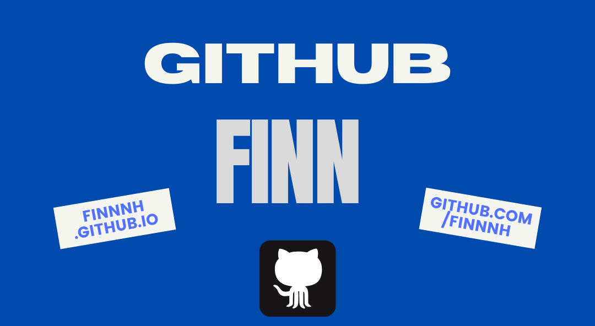

<h1 align="center">Hey✌️, I am Finn!</h1>
<h3 align="center">On my way to becoming a developer!</h3>

  

 
 
 

<h3 align="left">About Me:</h3>

🎖️ My Portfolio, Roadmap and all my Projects » [Portfolio](derlink.de)

🖥️ I’m currently working on » [Car-Rental](https://github.com/finnnh/Car-Rental)

💡 I’m currently learning » **Springboot & Kotlin**

📫 How to reach me » **fihoffmann@web.de**

 
 

<h3 align="left">Connect with me:</h3>

 

<h3 align="left">Languages and Tools:</h3>

         

<h3 align="left">Things on my Roadmap:</h3>

  </a>    </a>
 </a>  </a>   </a> </a>  

&nbsp;

